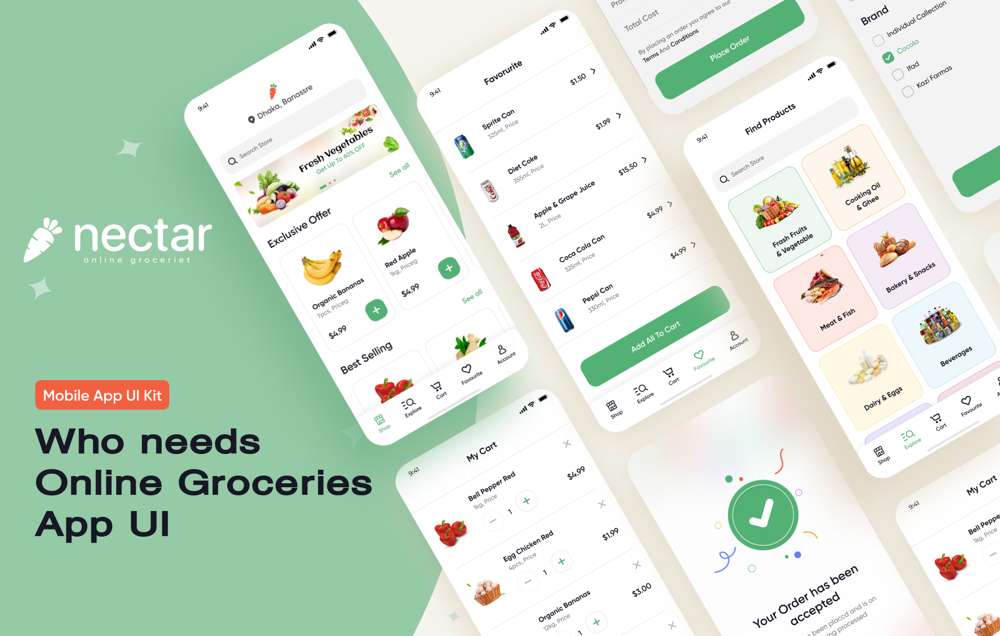

# Nectar Grocery Store
This project aims to create an app for a fictional online groceries store.
The designs for the app is created and owned by [Afsar](https://www.figma.com/@imshuvo97). Here is the link for [his project](https://www.figma.com/community/file/882645007956337261/online-groceries-app-ui) on the Figma community page.

# Goal
The goal for this app is to be a pet project in which I will apply the knoledge learned from Dr. Angela Yu's [iOS & Swift - The complete iOS App Development Bootcamp on Udemy](https://www.udemy.com/course/ios-13-app-development-bootcamp/)

The idea is to be evolving this app, following along the course's lecture and implementing the features from the original design along the way. Adding a piece or two of my own personality as we are moving throught it